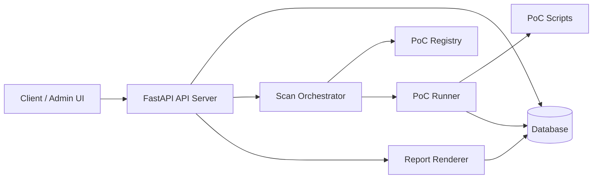
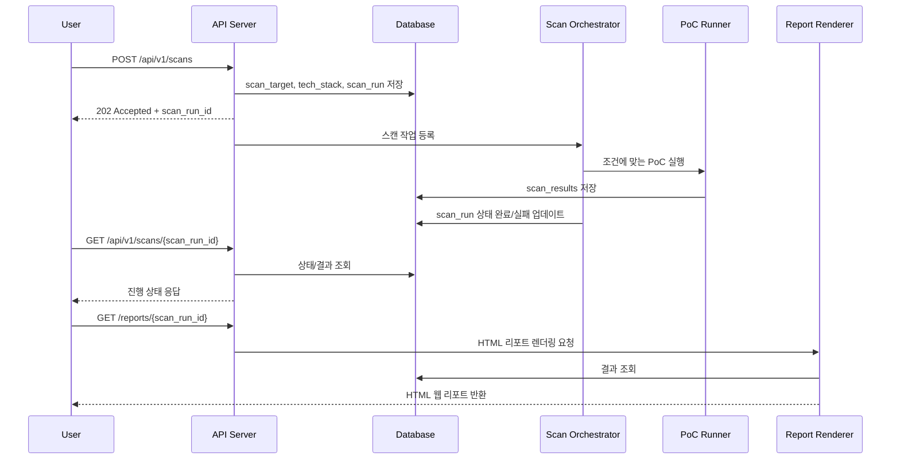

# Backend Prototype Design

이 문서는 현재 정의된 유즈케이스와 DB 설계를 바탕으로, 백엔드 프로토타입 구현 범위를 정리한 설계서입니다.

프로토타입의 핵심 흐름은 다음과 같습니다.

1. 사용자가 URL, 스택 이름, 스택 버전을 입력한다.
2. 시스템이 입력값을 저장하고 해당 조건에 맞는 PoC 코드를 실행한다.
3. 시스템이 취약점 결과를 저장하고 웹 리포트 형태로 제공한다.

## 1. 목표

### 포함 범위

- 검사 대상 URL 등록
- 스택 이름 및 버전 등록
- 입력값 기반 PoC 실행
- 취약점 결과 저장
- HTML 기반 웹 리포트 조회

### 제외 범위

- 크롤링 기반 엔드포인트 자동 수집
- 인증 정보 입력 및 로그인 세션 확보
- 대규모 분산 스캔
- 외부 CVE DB 실시간 동기화
- 관리자용 대시보드

## 2. 설계 가정

- 프로토타입 백엔드는 Python 기반으로 구현한다.
- API 서버는 `FastAPI`, ORM은 `SQLAlchemy`, 리포트 렌더링은 `Jinja2`를 사용한다.
- 저장소는 초기 프로토타입 기준 `SQLite` 또는 개발용 `PostgreSQL`을 사용한다.
- PoC 코드는 백엔드 내부에서 서브프로세스로 실행한다.
- PoC 실행은 비동기 Job 형태로 처리하며, 사용자는 Job 상태를 조회한다.

참고: 기술 스택은 구현 편의상 제안한 것이며, 문서의 핵심 인터페이스와 처리 흐름은 다른 백엔드 프레임워크로도 유지할 수 있다.

## 3. 상위 아키텍처



## 4. 처리 흐름



## 5. 핵심 컴포넌트

### 5.1 API Server

역할:

- 사용자 입력 수신
- 입력값 검증
- 스캔 작업 생성
- 상태 조회 API 제공
- 웹 리포트 HTML 반환

주요 책임:

- URL 형식 검증
- 스택 이름/버전 필수값 검증
- API 응답 표준화
- 오류 코드 관리

### 5.2 Scan Orchestrator

역할:

- 스캔 실행 제어
- 대상 스택에 맞는 PoC 선별
- 작업 상태 전이 관리

주요 책임:

- `QUEUED -> RUNNING -> COMPLETED` 상태 전환
- 실행 가능한 PoC 목록 조회
- 실패 시 `FAILED` 처리
- 타임아웃 및 예외 로깅

### 5.3 PoC Registry

역할:

- 어떤 PoC가 어떤 스택/버전에 적용되는지 관리

예시 규칙:

- `Nginx 1.18.x`용 PoC
- `Spring Boot 2.7.x`용 PoC
- 특정 CVE 전용 PoC

권장 저장 방식:

- 파일 기반 메타데이터 `pocs/<poc_name>/metadata.yaml`
- 또는 DB 기반 `poc_definitions` 테이블

프로토타입에서는 파일 기반 메타데이터가 단순하고 관리가 쉽다.

### 5.4 PoC Runner

역할:

- 실제 PoC 스크립트 실행
- 결과 파싱
- 표준 JSON 결과 생성

실행 방식:

- 백엔드가 서브프로세스로 실행
- 입력 파라미터를 CLI 인자 또는 JSON 파일로 전달
- 출력 결과를 표준 JSON으로 수집

필수 제어:

- 실행 타임아웃
- 최대 동시 실행 수 제한
- 비정상 종료 감지
- stderr 로그 저장

### 5.5 Report Renderer

역할:

- 스캔 결과를 HTML 보고서로 렌더링

리포트 포함 내용:

- 대상 URL
- 입력 스택 이름/버전
- 실행 시각
- 전체 결과 요약
- 취약점 목록
- CVE ID, 심각도, 설명, 근거
- 실패한 PoC 또는 미확인 항목

## 6. 제안 기술 스택

| 영역 | 제안 기술 | 이유 |
| --- | --- | --- |
| API | FastAPI | 빠른 프로토타입 개발, Pydantic 기반 검증 |
| ORM | SQLAlchemy | DB 추상화 및 마이그레이션 확장성 |
| DB | SQLite / PostgreSQL | 프로토타입 단순성, 이후 확장 가능 |
| 템플릿 | Jinja2 | 서버 렌더링 HTML 보고서 생성 용이 |
| 작업 처리 | FastAPI Background Task 또는 별도 Worker | 프로토타입 단계에서 단순한 비동기 처리 가능 |
| PoC 실행 | Python subprocess | 외부 PoC 실행 제어가 쉬움 |

## 7. API 설계

### 7.1 스캔 생성

`POST /api/v1/scans`

요청 예시:

```json
{
  "base_url": "https://example.com",
  "stack_name": "Nginx",
  "stack_version": "1.18.0"
}
```

처리:

- URL 형식 검증
- 검사 대상 생성 또는 조회
- 스택 정보 저장
- 스캔 실행 단위 생성
- 비동기 작업 등록

응답 예시:

```json
{
  "scan_run_id": 101,
  "target_id": 12,
  "status": "QUEUED"
}
```

### 7.2 스캔 상태 조회

`GET /api/v1/scans/{scan_run_id}`

응답 예시:

```json
{
  "scan_run_id": 101,
  "status": "RUNNING",
  "base_url": "https://example.com",
  "stack_name": "Nginx",
  "stack_version": "1.18.0",
  "summary": {
    "total_pocs": 4,
    "completed_pocs": 2,
    "vulnerabilities_found": 1
  }
}
```

### 7.3 결과 JSON 조회

`GET /api/v1/scans/{scan_run_id}/results`

응답 예시:

```json
{
  "scan_run_id": 101,
  "status": "COMPLETED",
  "results": [
    {
      "result_id": 9001,
      "vuln_category": "CVE",
      "cve_id": "CVE-2021-12345",
      "severity": "High",
      "description": "취약한 버전에 해당하며 PoC 응답 패턴이 일치함",
      "evidence": "HTTP 500 응답과 특정 헤더 패턴 확인",
      "status": "Found"
    }
  ]
}
```

### 7.4 웹 리포트 조회

`GET /reports/{scan_run_id}`

동작:

- 서버가 HTML을 직접 렌더링해서 반환한다.
- 별도 프론트엔드 없이 브라우저에서 결과를 바로 확인할 수 있다.

## 8. 데이터 모델 설계

현재 문서의 기존 테이블을 최대한 재사용하되, 실행 단위를 분리하기 위해 `scan_runs` 테이블을 추가한다.

### 8.1 재사용 테이블

- `scan_targets`
- `tech_stacks`
- `scan_results`

### 8.2 프로토타입에서 사실상 미사용 또는 축소 사용

- `endpoints`
  현재 프로토타입은 단일 `base_url` 기준으로 검사하므로 필수 사용 대상은 아니다.
- `auth_settings`
  로그인 기반 검사는 현재 범위에서 제외한다.

### 8.3 신규 제안 테이블: `scan_runs`

목적:

- 하나의 대상에 대해 여러 번 실행된 스캔을 구분
- 현재 진행 상태와 실행 이력을 분리 관리
- 리포트 조회 기준 제공

| 컬럼명 | 데이터 타입 | 제약 조건 | 설명 |
| --- | --- | --- | --- |
| `scan_run_id` | INT | PK, Auto Increment | 실행 단위 ID |
| `target_id` | INT | FK, NOT NULL | 검사 대상 ID |
| `stack_id` | INT | FK, NOT NULL | 실행 시 사용한 스택 정보 |
| `status` | VARCHAR | NOT NULL | `QUEUED`, `RUNNING`, `COMPLETED`, `FAILED` |
| `started_at` | TIMESTAMP | Nullable | 실행 시작 시각 |
| `finished_at` | TIMESTAMP | Nullable | 실행 종료 시각 |
| `report_path` | VARCHAR | Nullable | 정적 HTML 저장 시 파일 경로 |
| `error_message` | TEXT | Nullable | 실패 사유 |

### 8.4 `scan_results` 확장 제안

기존 `scan_results`는 `target_id` 중심이므로, 실행 단위를 구분하기 위해 `scan_run_id` FK를 추가하는 것이 바람직하다.

추가 권장 컬럼:

| 컬럼명 | 데이터 타입 | 설명 |
| --- | --- | --- |
| `scan_run_id` | INT | 어떤 실행 결과인지 구분 |
| `poc_name` | VARCHAR | 어떤 PoC가 결과를 생성했는지 식별 |
| `raw_output` | TEXT | PoC 원본 출력 저장 |

## 9. PoC 표준 인터페이스 설계

PoC별 구현 방식이 달라도, 백엔드가 동일하게 다루기 위해 입출력 포맷을 통일한다.

### 9.1 입력 파라미터

| 필드 | 타입 | 설명 |
| --- | --- | --- |
| `base_url` | string | 검사 대상 URL |
| `stack_name` | string | 사용자 입력 스택명 |
| `stack_version` | string | 사용자 입력 버전 |
| `timeout_seconds` | integer | 최대 실행 시간 |
| `headers` | object | 필요 시 추가 요청 헤더 |

### 9.2 출력 JSON 표준

```json
{
  "poc_name": "nginx_cve_2021_xxxx",
  "vulnerable": true,
  "vuln_category": "CVE",
  "cve_id": "CVE-2021-12345",
  "severity": "High",
  "description": "취약한 버전에 해당하고 응답 패턴이 일치함",
  "evidence": "특정 헤더와 응답 본문 패턴 확인",
  "raw_output": "stdout 또는 상세 결과",
  "status": "Found"
}
```

### 9.3 PoC 디렉터리 예시

```text
backend/
  app/
  pocs/
    nginx_cve_2021_xxxx/
      metadata.yaml
      runner.py
    springboot_actuator_exposure/
      metadata.yaml
      runner.py
  templates/
    report.html
```

### 9.4 PoC 메타데이터 예시

```yaml
name: nginx_cve_2021_xxxx
category: CVE
stack_name: Nginx
version_rules:
  - ">=1.18.0,<1.19.0"
severity: High
entrypoint: runner.py
timeout_seconds: 15
```

## 10. 스캔 실행 로직

### 10.1 입력 검증

- `base_url`은 `http` 또는 `https` 스킴만 허용
- `stack_name`은 빈 문자열 불가
- `stack_version`은 빈 문자열 불가

### 10.2 PoC 선택 규칙

- 스택 이름 일치 여부 확인
- 버전 조건 일치 여부 확인
- 일치하는 PoC만 실행

예:

- 입력: `Nginx 1.18.0`
- 실행 대상: `stack_name=Nginx`, `version_rules`에 `1.18.0`이 포함되는 PoC

### 10.3 실행 상태 전이

| 상태 | 설명 |
| --- | --- |
| `QUEUED` | 작업이 등록됨 |
| `RUNNING` | PoC 실행 중 |
| `COMPLETED` | 모든 PoC 실행 완료 |
| `FAILED` | 시스템 오류 또는 전체 실행 실패 |

### 10.4 실패 처리

- 특정 PoC 실패는 전체 스캔 실패로 보지 않고 개별 결과에 기록
- 전체 작업 초기화 실패 또는 DB 저장 실패는 `FAILED`
- 타임아웃은 결과 상태를 `Timeout`으로 저장

## 11. 웹 리포트 설계

리포트는 사용자가 브라우저에서 바로 확인할 수 있는 HTML 형태로 제공한다.

### 11.1 리포트 섹션

- 검사 개요
- 대상 정보
- 입력한 스택 정보
- 실행된 PoC 목록
- 발견된 취약점 요약
- 취약점 상세
- 실패 및 예외 항목

### 11.2 화면 예시 구조

```text
[리포트 제목]
스캔 ID / 실행 일시 / 대상 URL

[요약 카드]
총 PoC 수 / 성공 / 실패 / 발견 취약점 수

[취약점 목록]
- CVE-2021-12345 / High / Found
- XSS / Medium / Found

[상세 결과]
- 설명
- 근거
- 원본 출력 일부
```

### 11.3 제공 방식

- 동적 렌더링: 요청 시 DB에서 읽어 HTML 생성
- 선택 옵션: 스캔 완료 시 정적 HTML 파일 저장

프로토타입에서는 동적 렌더링이 단순하고, 이후 필요하면 정적 저장으로 확장한다.

## 12. 보안 및 운영 고려사항

- PoC 실행은 신뢰된 스크립트만 허용한다.
- 사용자 입력값을 셸 문자열로 직접 연결하지 않는다.
- 서브프로세스 실행 시 인자를 분리해 전달한다.
- 실행 시간 제한과 동시성 제한을 둔다.
- 내부망 또는 민감한 주소에 대한 접근 제한 정책을 둘 수 있다.
- `auth_data`와 같은 민감정보는 현재 프로토타입 범위에서는 저장하지 않는다.

## 13. 구현 우선순위

### 1차 구현

- `POST /api/v1/scans`
- `GET /api/v1/scans/{scan_run_id}`
- `GET /reports/{scan_run_id}`
- `scan_runs` 도입
- 파일 기반 PoC Registry
- HTML 리포트 렌더링

### 2차 구현

- `GET /api/v1/scans/{scan_run_id}/results`
- 정적 HTML 저장
- 실패 로그 상세화
- 단일 스택 외 복수 스택 입력 지원

### 3차 확장

- 인증 기반 검사
- 엔드포인트 단위 검사
- CVE DB 연동 자동화
- 스케줄 기반 재검사

## 14. 구현 결론

이 프로토타입은 "입력값 저장 -> 조건에 맞는 PoC 실행 -> 결과를 HTML 리포트로 제공"에 집중한 단일 백엔드 구조를 목표로 한다.

핵심 설계 포인트는 다음과 같다.

- 사용자 입력과 실행 이력을 분리하기 위해 `scan_runs`를 추가한다.
- PoC는 메타데이터 + 실행 스크립트 구조로 표준화한다.
- 스캔은 비동기 Job으로 실행하고 상태 조회 API를 제공한다.
- 결과는 JSON API와 HTML 리포트 양쪽으로 활용 가능하게 저장한다.

이 구조를 기준으로 구현하면, 이후 인증 검사, 엔드포인트 확장, CVE 자동 매핑 기능도 자연스럽게 붙일 수 있다.
