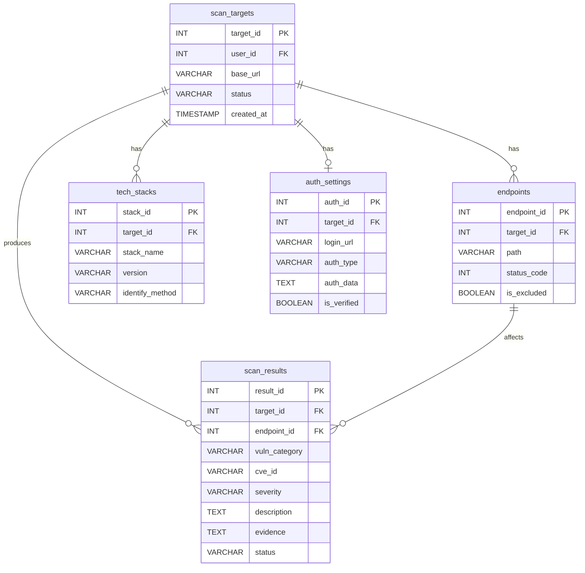

# Database Design

웹 서비스 보안 진단 시스템의 데이터베이스 설계를 정리한 문서입니다.

## ERD

## 테이블 개요

| 테이블명 | 목적 |
| --- | --- |
| `scan_targets` | 검사 대상 기본 정보 및 스캔 세션 관리 |
| `endpoints` | 검사 범위 및 세부 경로 저장 |
| `tech_stacks` | 서버 스택 및 버전 정보 저장 |
| `auth_settings` | 로그인 및 인증 정보 저장 |
| `scan_results` | 취약점 진단 결과 저장 |

---

## 1. `scan_targets`

검사 대상 기본 정보 테이블입니다. UC-01(검사 대상 등록)과 전체 진단 세션 관리에 사용됩니다.

| 컬럼명 | 데이터 타입 | 제약 조건 | 설명 |
| --- | --- | --- | --- |
| `target_id` | INT | PK, Auto Increment | 검사 대상 고유 식별자 |
| `user_id` | INT | FK, Nullable | 등록한 사용자 ID |
| `base_url` | VARCHAR | NOT NULL | 진단 대상의 기본 URL |
| `status` | VARCHAR |  | 스캔 상태 (`Ready`, `Scanning`, `Completed`, `Failed`) |
| `created_at` | TIMESTAMP |  | 검사 등록 일시 |

---

## 2. `endpoints`

검사 범위 및 상세 경로 테이블입니다. UC-02(검사 범위 설정)를 반영합니다.

| 컬럼명 | 데이터 타입 | 제약 조건 | 설명 |
| --- | --- | --- | --- |
| `endpoint_id` | INT | PK, Auto Increment | 엔드포인트 고유 ID |
| `target_id` | INT | FK | 소속된 검사 대상 ID |
| `path` | VARCHAR | NOT NULL | 상세 경로 (예: `/api/v1/users`) |
| `status_code` | INT |  | HTTP 응답 코드 확인용 |
| `is_excluded` | BOOLEAN | DEFAULT `0` | 검사 제외 경로 여부 |

---

## 3. `tech_stacks`

서버 스택 및 버전 정보 테이블입니다. UC-03(서버 스택/버전 입력 및 식별)을 반영하며, CVE 매핑의 핵심 데이터입니다.

| 컬럼명 | 데이터 타입 | 제약 조건 | 설명 |
| --- | --- | --- | --- |
| `stack_id` | INT | PK, Auto Increment | 스택 정보 고유 ID |
| `target_id` | INT | FK | 소속된 검사 대상 ID |
| `stack_name` | VARCHAR | NOT NULL | 스택명 (예: `React`, `Nginx`, `Spring Boot`) |
| `version` | VARCHAR | Nullable | 버전 정보 (미확인 시 `NULL`) |
| `identify_method` | VARCHAR |  | 식별 방법 (`Manual_Input`, `Auto_Detected`) |

---

## 4. `auth_settings`

인증 및 로그인 정보 테이블입니다. UC-04(인증 정보 설정 및 로그인 상태 확보)를 반영합니다.

| 컬럼명 | 데이터 타입 | 제약 조건 | 설명 |
| --- | --- | --- | --- |
| `auth_id` | INT | PK, Auto Increment | 인증 설정 고유 ID |
| `target_id` | INT | FK | 소속된 검사 대상 ID |
| `login_url` | VARCHAR | Nullable | 로그인 요청 URL |
| `auth_type` | VARCHAR | NOT NULL | 인증 방식 (`ID_PW`, `Token`, `Manual_Cookie`) |
| `auth_data` | TEXT |  | 계정 정보(암호화) 또는 세션/토큰/쿠키 값 |
| `is_verified` | BOOLEAN | DEFAULT `0` | 로그인/세션 검증 성공 여부 |

참고: 요구사항상 `scan_targets`와 `auth_settings`는 사실상 1:1 관계로 해석됩니다.

---

## 5. `scan_results`

취약점 진단 결과 테이블입니다. UC-05(스캔 실행) 및 UC-06(리포트 출력) 데이터를 저장합니다.

| 컬럼명 | 데이터 타입 | 제약 조건 | 설명 |
| --- | --- | --- | --- |
| `result_id` | INT | PK, Auto Increment | 취약점 결과 고유 ID |
| `target_id` | INT | FK | 어떤 검사 대상에서 나왔는지 식별 |
| `endpoint_id` | INT | FK, Nullable | 특정 엔드포인트에 매핑되는 경우 사용 |
| `vuln_category` | VARCHAR | NOT NULL | 취약점 종류 (`CVE`, `SQL_Injection`, `XSS` 등) |
| `cve_id` | VARCHAR | Nullable | CVE 기반 취약점 식별 코드 |
| `severity` | VARCHAR | NOT NULL | 심각도 (`Critical`, `High`, `Medium`, `Low`, `Info`) |
| `description` | TEXT |  | 취약점 상세 설명 및 권고사항 |
| `evidence` | TEXT |  | 재현 근거 |
| `status` | VARCHAR | DEFAULT `'Found'` | 상태 또는 실패 사유 (`Found`, `Timeout`, `Auth_Failed` 등) |

---

## 관계 요약

- 하나의 `scan_targets`는 여러 개의 `endpoints`를 가진다.
- 하나의 `scan_targets`는 여러 개의 `tech_stacks`를 가질 수 있다.
- 하나의 `scan_targets`는 하나의 `auth_settings`를 가진다.
- 하나의 `scan_targets`는 여러 개의 `scan_results`를 가진다.
- 하나의 `endpoint`는 여러 개의 `scan_results`와 연결될 수 있다.
